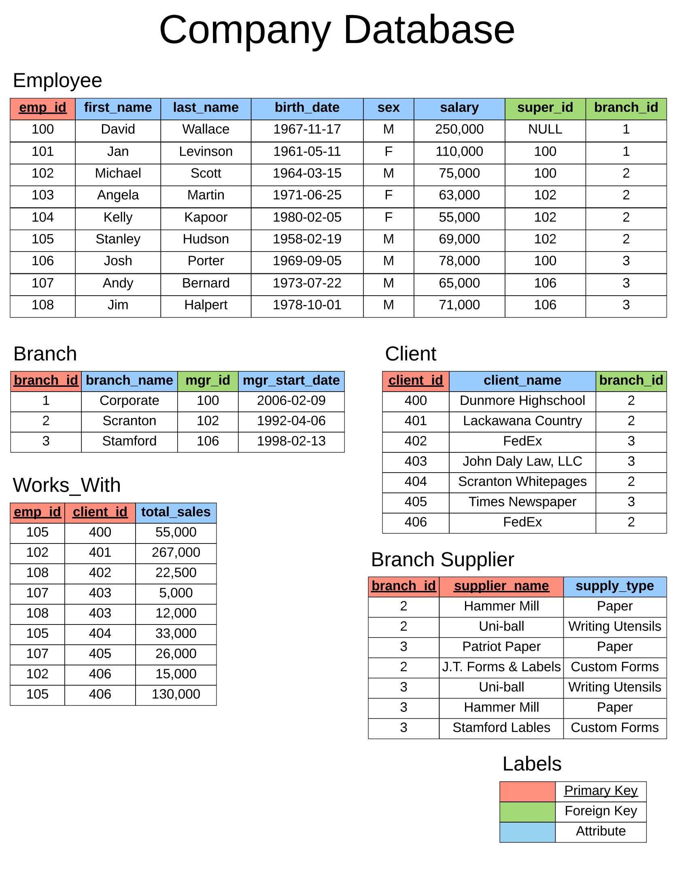

# Queries on bigger and more complex database

Creating the database <a href="Database/build.sql">code</a>

</img>

<h2> More complex oprations on database</h2>

 
|<a href="Functions/Functions.sql">Functions<a/>|<a href="Wildcards/Wildcards.sql">Wildcards<a/>|<a href="Unions/Unions.sql">Unions<a/>|<a href="Joins/Joins.sql">Joins</a>|<a href="Nested queries/NestedQueries.sql">"Nested queries</a>|<a href="On Delete/OnDelete.sql">On Delete</a>|<a href="Triggers/Triggers.sql">Triggers</a>|
|:---:|:---:|:---:|:---:|:---:|:---:|:---:|

